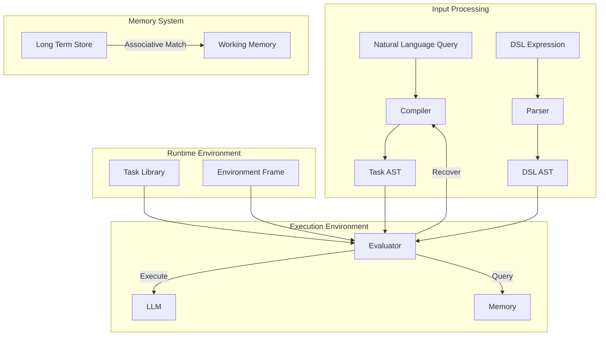

# System summary

## Overview

This starting point of this project is the idea of treating natural language interaction as a fancy form of machine code execution. To make good use of it we have to go past writing programs in assembly language (i.e. raw, unstructured prompting).

I would like to eventually develop a domain-specific language (DSL) to represent task composition, manage execution flow, and make LLM workflows very dynamic. In the mean time there are some easier goals.

## Documentation Index

### Architecture Documentation

- [Architecture Overview](architecture/overview.md): High-level system architecture and navigation index.
- **Architecture Decision Records (ADRs):**
  - [001-memory-system.md](architecture/decisions/001-memory-system.md): Memory System Design.
  - [002-context-management.md](architecture/decisions/002-context-management.md): Context Management Architectural Decisions.
  - [003-memory-context-update.md](architecture/decisions/003-memory-context-update.md): Remove Context Update Capability.
  - [004-sequential-context-management.md](architecture/decisions/004-sequential-context-management.md): Sequential Context Management.
  - [005-context-handling.md](architecture/decisions/005-context-handling.md): Context Generation Clarifications.

### Architectural Patterns

- [Director-Evaluator Pattern](architecture/patterns/director-evaluator.md): Detailed description of the Director-Evaluator pattern.
- [Context Frame Pattern](architecture/patterns/context-frames.md): Explanation of context frames and environment management.
- [Resource Management Pattern](architecture/patterns/resource-management.md): Strategies for resource tracking and cleanup.

### System Contracts

- [System Protocols](contracts/protocols.md): Specifications for system protocols and task template schemas.
- [System Interface Contracts](contracts/interfaces.md): Definitions of component integration contracts and interfaces.
- [Resource Management Contracts](contracts/resources.md): Guidelines for resource types and management protocols.

### Associative Matching and Template Library

- [Memory System Interfaces](../components/memory/api/interfaces.md): Details on the Memory System and associative matching mechanisms.
- [Memory System Component](../components/memory/README.md): Overview of the Memory System's role in context management and associative matching.
- [Task System Types](../components/task-system/spec/types.md): Definitions of task types, including associative matching inputs and outputs.
- [Task System Interfaces](../components/task-system/spec/interfaces.md): Interfaces related to the Task System and template handling.
- [System Protocols](contracts/protocols.md): Specifications for system protocols, including the task template schema.
- [Task System Component](../components/task-system/README.md): Overview of the Task System, including template-based task execution.

### Frequently Asked Questions

- [Resource Management Q&A](architecture/qa/resource-management.md): Clarifications on resource ownership and management.

### Open Questions

- [Architecture Questions](architecture/questions.md): A list of unresolved architecture questions.

## Architecture



This architecture contains a few high-level components: the Task system manages template matching and execution through XML task definitions; the Evaluator controls AST processing and handles failure recovery through task decomposition; the Memory system maintains a global file metadata index and provides associative matching for context retrieval.)

Task execution supports several patterns through XML templates. One useful one is the Director-Evaluator pattern, which essentially consists of two agents talking back and forth. In a loop, one agent tries to carry out a task while the other checks the first one's work:

```xml
<task type="sequential">
    <description>Static Director-Evaluator Pipeline</description>
    <context_management>
        <inherit_context>none</inherit_context>
        <accumulate_data>true</accumulate_data>
    </context_management>
    <steps>
        <task><description>Generate Initial Output</description></task>
        <task type="script"><description>Run Target Script</description></task>
        <task><description>Evaluate Script Output</description></task>
    </steps>
</task>
```

The Memory System operates in read-only mode for file metadata access. Direct file operations rely on tool use APIs. 

## Basic Usage

```typescript
const taskSystem = new TaskSystem({
    maxTurns: 10,
    maxContextWindowFraction: 0.8,
    systemPrompt: "System-level context"
});

const result = await taskSystem.executeTask(
    "Process and analyze experimental data",
    memorySystem
);
```

## Future Extensions

A DSL frontend will eventually provide a more expressive way to compose tasks:

```scheme
(define (process-data data-source)
  (sequential
    (task "load-data" data-source)
    (reduce
      (lambda (chunk acc) (task "analyze-chunk" chunk acc))
      initial-value
      chunks)))
```

For detailed implementation specifications and patterns, refer to the system- and component-level documentation (especially components/task-system/).
