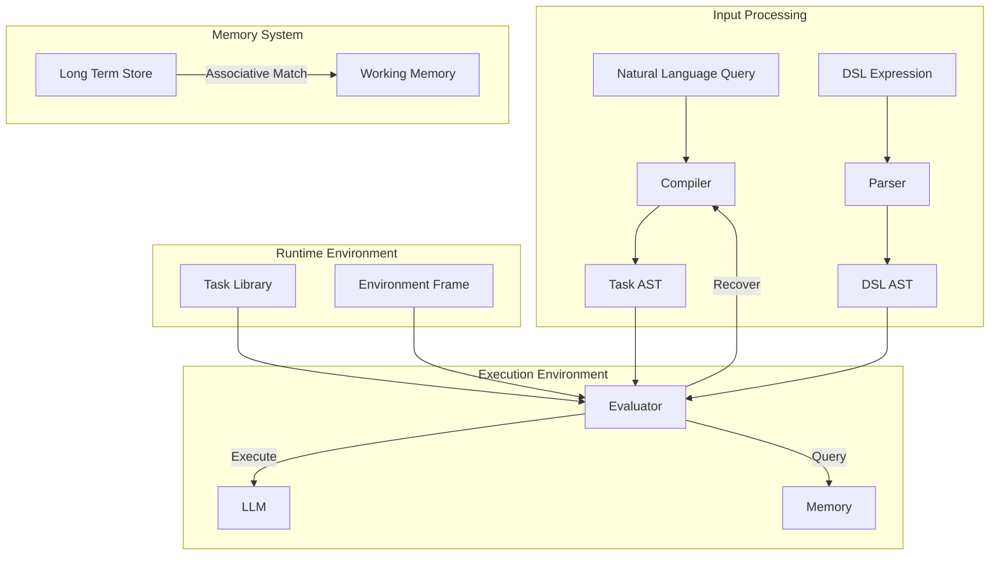

# System summary

## Overview

This starting point of this project is the idea of treating natural language interaction as a form of code execution. We'll eventually use a domain-specific language (DSL) to represent task decomposition and manage execution flow.

## Architecture



This architecture contains a few high-level components: the Task system manages template matching and execution through XML task definitions; the Evaluator controls AST processing and handles failure recovery through task decomposition; the Memory system maintains a global file metadata index and provides associative matching for context retrieval.)

Task execution supports several patterns through XML templates. One useful one is the Director-Evaluator pattern, which essentially consists of two agents talking back and forth. In a loop, one agent tries to carry out a task while the other checks the first one's work:

```xml
<task type="sequential">
    <description>Static Director-Evaluator Pipeline</description>
    <context_management>
        <inherit_context>none</inherit_context>
        <accumulate_data>true</accumulate_data>
    </context_management>
    <steps>
        <task><description>Generate Initial Output</description></task>
        <task type="script"><description>Run Target Script</description></task>
        <task><description>Evaluate Script Output</description></task>
    </steps>
</task>
```

The Memory System operates in read-only mode for file metadata access. Direct file operations rely on tool use APIs. 

## Basic Usage

```typescript
const taskSystem = new TaskSystem({
    maxTurns: 10,
    maxContextWindowFraction: 0.8,
    systemPrompt: "System-level context"
});

const result = await taskSystem.executeTask(
    "Process and analyze experimental data",
    memorySystem
);
```

## Future Extensions

A DSL frontend will eventually provide a more expressive way to compose tasks:

```scheme
(define (process-data data-source)
  (sequential
    (task "load-data" data-source)
    (reduce
      (lambda (chunk acc) (task "analyze-chunk" chunk acc))
      initial-value
      chunks)))
```

For detailed implementation specifications and patterns, refer to the component-level documentation (especially components/task-system/).
